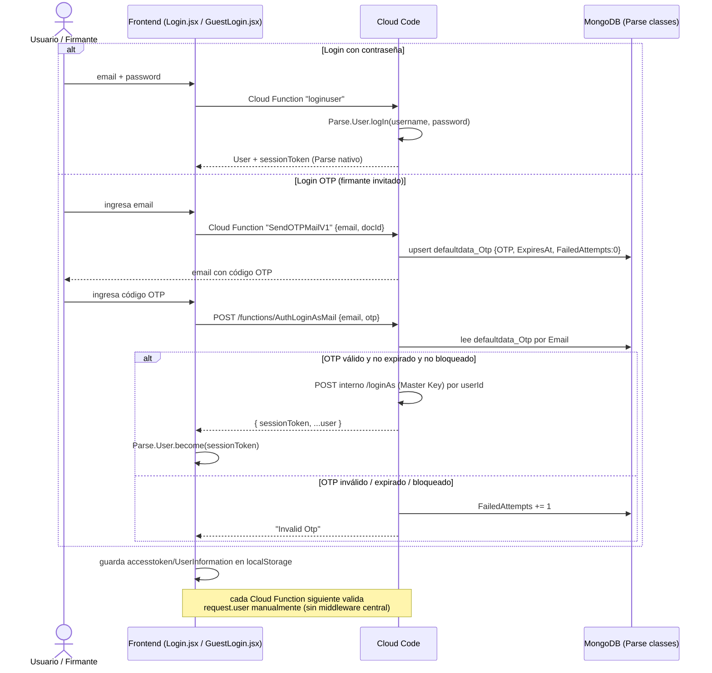

# Autenticación y multitenancy

Este documento describe cómo FibexSign autentica usuarios (con y sin contraseña), cómo se administra la sesión sobre el SDK de Parse, cómo funciona el aislamiento multi-tenant (`partners_Tenant`) y cómo se modela el perfil de usuario extendido (`contracts_Users`). Todo lo aquí descrito fue verificado leyendo el código fuente en `apps/OpenSignServer/cloud/parsefunction/` y `apps/OpenSign/src/`; donde el issue original asumía un mecanismo que no corresponde al código real, se indica explícitamente.

## Nota sobre `withSessionValidation`

El pedido original de documentación asumía la existencia de un middleware de backend llamado `withSessionValidation`. Verificación real:

- **No existe** ningún middleware ni función con ese nombre en `apps/OpenSignServer`. Cada Cloud Function valida la sesión por su cuenta (ver más abajo).
- **Sí existe** `withSessionValidation` como utilidad de **frontend**, en `apps/OpenSign/src/utils/withSessionValidation.js`. No es un middleware de servidor: es un higher-order function que envuelve *handlers* de UI (más de 20 componentes lo usan) para comprobar, antes de ejecutar la acción, que exista `localStorage.TenantId` y un `Parse.User.current().getSessionToken()` válido. Si falta alguno, despacha `sessionStatus(false)` a Redux (`apps/OpenSign/src/redux/reducers/userReducer.js`) y aborta sin llamar al backend.

```javascript
// apps/OpenSign/src/utils/withSessionValidation.js
export function withSessionValidation(fn) {
  return async (...args) => {
    const tenantId = localStorage.getItem("TenantId");
    const sessionToken = Parse.User.current?.()?.getSessionToken?.();
    if (!tenantId || !sessionToken) {
      store.dispatch(sessionStatus(false));
      throw new Error("invalid session token");
    }
    return await fn(...args);
  };
}
```

Cuando `sessionStatus` pasa a `false`, `HomeLayout` (`apps/OpenSign/src/layout/HomeLayout.jsx`) y la ruta `Validate` (`apps/OpenSign/src/primitives/Validate.jsx`) dejan de renderizar el `Outlet` y muestran `SessionExpiredModal`, que fuerza `Parse.User.logOut()` y redirige a login. Es, en definitiva, un guard de UX en el cliente — **no** reemplaza ni implementa control de acceso en el servidor.

La autorización real de cada operación ocurre en el backend, función por función, como se describe a continuación.

## Sesión: Parse SDK, sin middleware centralizado

Parse Server gestiona las sesiones de forma nativa: `Parse.User.logIn()` / `Parse.User.become(sessionToken)` en el cliente producen un `sessionToken` que viaja en el header `X-Parse-Session-Token` en cada request subsiguiente del SDK. Parse Server resuelve ese token y, si es válido, puebla `request.user` antes de invocar la Cloud Function.

**No hay ningún middleware centralizado que rechace requests sin sesión.** El patrón real, repetido de forma manual en decenas de funciones, es:

```javascript
// apps/OpenSignServer/cloud/parsefunction/addUser.js
if (!request.user) {
  throw new Parse.Error(Parse.Error.INVALID_SESSION_TOKEN, 'Invalid session token.');
}
```

Ejemplos verificados de este patrón: `addUser.js`, `getTenant.js`, `updateTenant.js`, `getUserListByOrg.js`, `filterDocs.js`, `getSigners.js`, `updatesignaturetype.js`. Cada función es responsable de su propio chequeo; una función nueva que olvide el `if (!request.user)` quedaría abierta sin que ningún otro componente lo detecte. Esto es una observación de diseño, no necesariamente un defecto — es coherente con cómo Parse Cloud Code se usa habitualmente — pero implica que la superficie de auditoría de seguridad es "una función a la vez".

Algunas funciones (`declinedocument.js`, `cloud/parsefunction/pdf/PDF.js`) sólo exigen `request.user` **condicionalmente**, cuando el documento tiene `IsEnableOTP: true`; si el flag está apagado, aceptan el `userId` como parámetro sin sesión Parse asociada (ver `docs/signing-ceremony.md`).

Tampoco existe `Parse.Role` / la clase `_Role` de Parse en este código — no hay un sistema de roles formal. Los "roles" (`contracts_Admin`, `contracts_OrgAdmin`, `contracts_Guest`) son valores de texto libre en el campo `UserRole` de `contracts_Users`/`contracts_Contactbook`, comparados manualmente:

```javascript
// apps/OpenSignServer/cloud/parsefunction/updateTenant.js
const callerRole = callerExtUser.get('UserRole');
if (callerRole !== 'contracts_Admin' && callerRole !== 'contracts_OrgAdmin') {
  throw new Parse.Error(Parse.Error.OPERATION_FORBIDDEN, 'Unauthorized.');
}
```

De nuevo: observación de arquitectura, no un hallazgo de seguridad puntual — pero documentarlo es importante porque un futuro rol nuevo requiere tocar cada función relevante a mano, y no hay un catálogo único de permisos.

## Login con contraseña

`apps/OpenSign/src/pages/Login.jsx` invoca el flujo estándar de Parse (`Parse.User.logIn` vía la Cloud Function `loginuser` → `apps/OpenSignServer/cloud/parsefunction/loginUser.js`):

```javascript
// loginUser.js
const user = await Parse.User.logIn(username, password);
```

Errores de Parse (`OBJECT_NOT_FOUND`, `CONNECTION_FAILED`, rate limit 429) se traducen en `Login.jsx` a mensajes localizados (`invalid-username-password-region`, `too-many-login-attempts`, `server-error`). Tras el login, `Login.jsx` resuelve el perfil extendido (`contracts_Users`) para decidir a qué ruta redirigir según `UserRole`; si no encuentra el registro extendido, cierra la sesión (`logOutUser()`).

## Login sin contraseña (OTP) — firmante invitado y verificación de email

Este flujo es el mecanismo real detrás de "login sin contraseña": un código OTP de un solo uso, no un login social ni un magic-link JWT.

1. **Solicitud del código** — `Parse.Cloud.run('SendOTPMailV1', { email, docId })` invoca `apps/OpenSignServer/cloud/parsefunction/SendMailOTPv1.js`. Genera un código numérico de 4 dígitos (`randomInt(1000, 10000)`), lo envía por email vía `Parse.Cloud.sendEmail`, y lo persiste en la clase Parse `defaultdata_Otp` (campos `Email`, `OTP`, `ExpiresAt` = +10 minutos, `FailedAttempts: 0`). Si el pedido de OTP viene ligado a un documento (`docId`), además actualiza el contador de correos del `ExtUserPtr` dueño del documento.
2. **Verificación del código** — el cliente llama directamente por REST (no `Parse.Cloud.run`) a `functions/AuthLoginAsMail` (`apps/OpenSignServer/cloud/parsefunction/AuthLoginAsMail.js`). Esta función:
   - Busca el registro en `defaultdata_Otp` por `Email`.
   - Rechaza con `'Invalid Otp'` si expiró (`ExpiresAt`), si superó `MAX_OTP_ATTEMPTS = 5` intentos fallidos, o si el código no coincide — incrementando `FailedAttempts` en cada intento fallido.
   - Si el código es válido, resuelve el `Parse.User` cuyo `email` coincide y llama internamente al endpoint `POST {serverUrl}/loginAs` **usando la Master Key**, que devuelve un `sessionToken` real de Parse para ese usuario sin haber usado contraseña.
   - Si el usuario tenía `emailVerified: false`, lo marca en `true` en el mismo paso (por eso esta función también sirve como verificación de email).
3. **Establecimiento de sesión en el cliente** — `GuestLogin.jsx` recibe `{ sessionToken, ...user }` y llama `await Parse.User.become(_user.sessionToken)`, guarda `accesstoken`, `UserInformation` y la clave `Parse/<appId>/currentUser` en `localStorage`, y navega a `/load/recipientSignPdf/:docId/:contactId`. Desde ese punto, el firmante invitado tiene una sesión Parse legítima igual que un usuario logueado con contraseña.

`GuestLogin.jsx` es el punto de entrada para firmantes **sin cuenta previa** en la plataforma: si el email no corresponde a ningún contacto conocido del documento, el propio componente ofrece un formulario (`handleUserData` → `Parse.Cloud.run('linkcontacttodoc', ...)` → `apps/OpenSignServer/cloud/parsefunction/linkContactToDoc.js`) que crea el contacto (`contracts_Contactbook`, `UserRole: 'contracts_Guest'`) y lo vincula al documento antes de continuar.

## Diagrama — login con contraseña vs. login OTP (firmante invitado)



## Multitenancy: `partners_Tenant`

El aislamiento entre organizaciones se modela con la clase Parse `partners_Tenant`, no con bases de datos ni esquemas separados:

- `apps/OpenSignServer/cloud/parsefunction/getTenant.js` (`gettenant`) resuelve el tenant a partir de `userId` (requiere `request.user`) o de `contactId` (sin requerir sesión, para flujos de firmante invitado).
- `apps/OpenSignServer/cloud/parsefunction/updateTenant.js` (`updatetenant`) permite actualizar campos de branding/plantillas de correo (`CompletionBody`, `CompletionSubject`, `RequestBody`, `RequestSubject`, `EmailEditorType`) — pero **deriva el tenant y el rol del llamante desde el servidor** (consulta `contracts_Users` por `request.user.id`) en vez de confiar en el `tenantId` recibido del cliente, y sólo permite `contracts_Admin`/`contracts_OrgAdmin` cuyo `TenantId` coincide con el tenant que intentan modificar.
- `apps/OpenSignServer/cloud/parsefunction/TenantAfterFind.js` es un hook `afterFind` sobre `partners_Tenant` que resuelve URLs firmadas (presigned) para `Logo`/`Favicon` antes de devolver el objeto al cliente.
- `apps/OpenSignServer/cloud/parsefunction/GetLogoByDomain.js` (`getlogobydomain`) resuelve branding **por dominio**, sin sesión: consulta `partners_Tenant` por `Domain` y devuelve `{ logo, favicon, appname, user: 'exist' | 'not_exist' }`. Se usa para pintar el logo correcto en la pantalla de login antes de que el usuario se identifique, y para distinguir instalaciones "greenfield" (sin ningún tenant) de instalaciones ya provisionadas.

No hay row-level security de Mongo ni particionado físico: el aislamiento depende de que cada consulta relevante incluya un filtro por `TenantId`/`OrganizationId` a nivel de Cloud Function (ver también `getUserListByOrg.js`, que valida explícitamente que el `OrganizationId` pedido pertenezca al tenant/organización del llamante antes de listar usuarios).

## Perfil de usuario extendido: `contracts_Users` (no "UserExtend")

El issue original se refería a esto informalmente como "UserExtend". **En el código no existe una clase con ese nombre**; la clase real es `contracts_Users`, un objeto Parse independiente con un puntero (`UserId`) a `_User`, que guarda los datos que Parse `_User` no modela (rol, tenant, organización, plan de firma, preferencias, timezone, etc.).

- `apps/OpenSignServer/cloud/parsefunction/isextenduser.js` (`isextenduser`) sólo comprueba, por email, si ya existe un registro `contracts_Users` — se usa para decidir si un usuario recién autenticado necesita completar el onboarding.
- `apps/OpenSignServer/cloud/parsefunction/getUserDetails.js` resuelve el registro `contracts_Users` del usuario actual (o por email), incluyendo `TenantId` y excluyendo campos sensibles (`google_refresh_token`, `TenantId.PfxFile`, `authData`).
- En el frontend, el registro se cachea en `localStorage` bajo las claves `Extand_Class` (array con el objeto `contracts_Users`) y `UserInformation` (objeto `_User` crudo de Parse). `apps/OpenSign/src/pages/UserProfile.jsx` lee ambas para pintar/editar el perfil, y envuelve la mutación (`updateExtUser`) con `withSessionValidation` antes de llamar al backend — el mismo guard de UI descrito arriba, no una autorización de servidor adicional.
- `updatesignaturetype.js`, `updatePreferences.js` y otras funciones de preferencias actualizan el mismo objeto `contracts_Users` (localizándolo vía `request.user.id`), nunca el objeto `_User` de Parse directamente.

## Ver también

- [../README.md](../README.md)
- [./environment-variables.md](./environment-variables.md)
- [./turborepo-configuration.md](./turborepo-configuration.md)
- [./document-preparation-and-sending.md](./document-preparation-and-sending.md)
- [./signing-ceremony.md](./signing-ceremony.md)
- [./cloud-functions-catalog.md](./cloud-functions-catalog.md)
- [./rate-limiting.md](./rate-limiting.md)
- [./testing-guide.md](./testing-guide.md)
- [./deployment-guide.md](./deployment-guide.md)
- [./email-builder.md](./email-builder.md)
- [./opensign-drive.md](./opensign-drive.md)
- [./reports.md](./reports.md)
- [./internationalization.md](./internationalization.md)
- [./frontend-architecture.md](./frontend-architecture.md)
