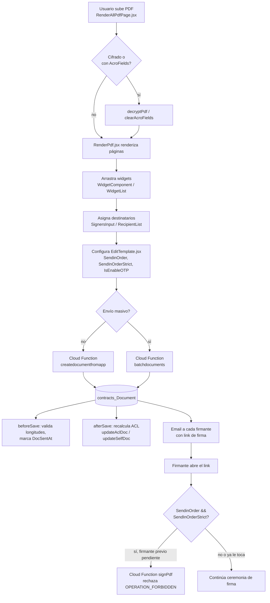

# Preparación y envío de documentos

Este documento cubre el flujo de negocio desde que un usuario sube o crea un PDF hasta que el documento queda enviado a sus destinatarios: renderizado del PDF en el editor, tipos de widget disponibles, asignación de destinatarios y el orden (real, verificado en código) en que deben firmar. Todo lo descrito está verificado contra `apps/OpenSign/src/components/pdf/` y `apps/OpenSignServer/cloud/parsefunction/`.

## Subida y renderizado del PDF

`apps/OpenSign/src/components/pdf/RenderAllPdfPage.jsx` es el punto de entrada de subida de archivo (`handleFileUpload`):

1. Valida tipo (`application/pdf`) y tamaño máximo configurado (`maxFileSize`).
2. Convierte el archivo a `ArrayBuffer` y verifica si está protegido con contraseña (`isPdfPasswordProtected`).
3. Ejecuta `clearAcroFields` (limpieza best-effort de campos de formulario/AcroForm preexistentes en el PDF, para evitar datos residuales de un PDF reciclado).
4. Si el PDF está cifrado, intenta desencriptarlo (`decryptPdf`) y, si falla sin contraseña, pide una contraseña al usuario (`prompt`) antes de reintentar.

El renderizado página a página ocurre en `apps/OpenSign/src/components/pdf/RenderPdf.jsx`, sobre `react-pdf`/`pdfjs-dist` (worker cargado desde CDN en `App.jsx`: `pdfjs.GlobalWorkerOptions.workerSrc`). Este componente:

- Mantiene refs por página (`pageRefs`) para scroll-tracking y para resolver sobre qué página cae un drop de widget.
- Calcula el escalado real de cada widget respecto al tamaño original del PDF vs. el tamaño renderizado en pantalla (`getContainerScale`, `posWidth`, `posHeight`, usando `defaultWidthHeight(pos.type)` como tamaño por defecto según el tipo de widget).
- Soporta pinch-to-zoom (`usePdfPinchZoom`) y guías de alineación (`useGuidelinesContext`).

`apps/OpenSign/src/components/pdf/EditTemplate.jsx` es el modal donde se configuran los metadatos del documento/plantilla antes o durante la edición: nombre, nota, descripción (con límites `MAX_NAME_LENGTH`/`MAX_NOTE_LENGTH`/`MAX_DESCRIPTION_LENGTH` reforzados también server-side en `DocumentBeforesave.js`), recordatorios automáticos, redirect URL post-firma, colores de lapicera, y — relevante para este documento — los flags de orden de firma y OTP que se detallan más abajo. También calcula un hash de metadatos de páginas (`getPdfMetadataHash`, SHA-256 sobre ancho/alto de cada página) usado para detectar si el PDF subido cambió de estructura al reemplazar el archivo de una plantilla existente.

## Tipos de widget

`apps/OpenSign/src/components/pdf/WidgetComponent.jsx` define el catálogo real de widgets arrastrables (`draggableItems`):

```
signature, stamp, initials, textInputWidget, name, job title, company,
email, date, textWidget, cellsWidget, checkbox, dropdown, radioButtonWidget,
image, drawWidget
```

Cada entrada se convierte en un elemento arrastrable vía `useWidgetDrag` (hook de drag-and-drop propio, en `apps/OpenSign/src/hook/useWidgetDrag.js`) y se renderiza con `apps/OpenSign/src/components/pdf/getWidgetType.jsx`, que soporta una variante compacta para mobile (`isMobileView`). `apps/OpenSign/src/components/pdf/WidgetList.jsx` es quien itera la lista de widgets ya colocados (`props.updateWidgets()`) y engancha los refs de drag sólo en desktop.

Al soltar un widget sobre el PDF, `RenderPdf.jsx` calcula la posición absoluta corrigiendo por el `containerScale` de la página, y el tamaño por defecto proviene de `defaultWidthHeight(pos.type)` (`apps/OpenSign/src/constant/Utils.js`) salvo que el widget ya tenga `Width`/`Height` explícitos guardados.

## Asignación de destinatarios

- `apps/OpenSign/src/components/pdf/RecipientList.jsx` es la lista de destinatarios ya agregados al documento, con drag handles (`e.dataTransfer.setData`) para reordenar manualmente, color por firmante (`nameColor`, `darkenColor`) e indicador de si el firmante ya tiene al menos un widget colocado (`isWidgetExist`).
- `apps/OpenSign/src/components/pdf/SignerListPlace.jsx` envuelve `RecipientList` en las pantallas de colocación de campos (`PlaceHolderSign.jsx`, `TemplatePlaceholder.jsx`) y expone `handleAddRecipient` para agregar un firmante nuevo desde ese mismo panel.
- `apps/OpenSign/src/components/shared/fields/SignersInput.jsx` es el selector usado en el formulario de creación/edición (`EditTemplate.jsx`, `Form.jsx`): un multi-select con función `arrayMove` para **reordenar destinatarios por drag** (`onSortEnd`). Este orden visual es el que alimenta el array `Signers`/`Placeholders` que se persiste en `contracts_Document`.
- La búsqueda de contactos existentes al tipear un email/nombre usa la Cloud Function `getsigners` → `apps/OpenSignServer/cloud/parsefunction/getSigners.js`, que busca en `contracts_Contactbook` por `Name`/`Email` (regex escapado) filtrando por `CreatedBy` del usuario autenticado — requiere `request.user`.

## Orden de firma: `SendinOrder` y `SendInOrderStrict` (verificado)

El issue pedía verificar si existe un orden real de firmantes en vez de asumirlo. Se confirmó que sí existe, con dos flags independientes sobre `contracts_Document`/`contracts_Template`:

- **`SendinOrder`** (boolean): indica que el documento tiene un orden de firmantes definido (el orden del array `Signers`/`Placeholders` tal como quedó tras el drag-reorder en `SignersInput`). Se persiste en `EditTemplate.jsx` (`formData.SendinOrder`) y se guarda en `createDocumentFromApp.js`, `createBatchDocs.js` y `saveAsTemplate.js`.
- **`SendInOrderStrict`** (boolean, agregado en la migración `20260430000000-add_sendinorderstrict_field.cjs`): habilita la **aplicación forzosa** del orden en el momento de firmar.

La aplicación real del orden ocurre del lado servidor, en la Cloud Function de firma (`apps/OpenSignServer/cloud/parsefunction/pdf/PDF.js`, función `PDF`/`signPdf`), **no** en el frontend:

```javascript
// apps/OpenSignServer/cloud/parsefunction/pdf/PDF.js
if (reqUserId && _resDoc?.SendinOrder === true && _resDoc?.SendInOrderStrict === true) {
  const placeholders = _resDoc.Placeholders.filter(p => p?.Role !== 'prefill');
  const myIdx = findPlaceholderIndex(placeholders, reqUserId);
  if (myIdx > 0) {
    const pendingId = findPendingPriorSigner(placeholders, myIdx, _resDoc?.AuditTrail);
    if (pendingId) {
      throw new Parse.Error(Parse.Error.OPERATION_FORBIDDEN,
        'Strict signing order is enabled — please wait for the previous signers to complete their action before signing.');
    }
  }
}
```

Es decir: si `SendinOrder` está activo pero `SendInOrderStrict` no, el orden es sólo una sugerencia de UI/notificación (por ejemplo, para decidir a quién notificar primero); si ambos están activos, el backend rechaza con `OPERATION_FORBIDDEN` cualquier intento de firma fuera de secuencia, comparando el índice del firmante actual contra las entradas de `AuditTrail` de los firmantes anteriores. El chequeo se salta para el dueño del documento (`className === 'contracts_Users'`, es decir cuando no hay `reqUserId`), porque el dueño no firma por este camino.

## Creación y envío del documento

Dos caminos, según si se envía a uno o a muchos documentos/destinatarios a la vez:

- **`createdocumentfromapp`** → `apps/OpenSignServer/cloud/parsefunction/createDocumentFromApp.js`: crea un único `contracts_Document` a partir del payload armado en el editor (requiere `request.user`). Persiste, entre otros, `Name`, `URL`, `ExtUserPtr`, `CreatedBy`, `OriginIp`, `SentToOthers`, `SendinOrder`, `SendInOrderStrict`, `IsEnableOTP`, `AllowModifications`, `AutomaticReminders`, `NotifyOnSignatures`, `TimeToCompleteDays`, `RemindOnceInEvery`, `Signers[]`, `Placeholders[]`, `SignatureType[]`, `Bcc[]`, `Cc[]`, `PenColors[]`. Al terminar, actualiza el contador de documentos del `ExtUserPtr` (`setDocumentCount`).
- **`batchdocuments`** → `apps/OpenSignServer/cloud/parsefunction/createBatchDocs.js`: cubre el envío masivo ("bulk send"/"quick send"), con control de concurrencia manual (`chunkArray` + `mapWithConcurrency`, un pool de workers async) para no saturar la API al crear/enviar muchos documentos a la vez. Envía un correo resumen al dueño (`sendOwnerSummaryEmail`) y, por cada destinatario, un correo individual con el link de firma (`login/<base64(docId/email)>`), reemplazando variables de plantilla (`replaceMailVaribles`) o cayendo al cuerpo por defecto (`mailTemplate`). Descuenta el conteo de documentos (`deductcount`) según la cantidad de documentos realmente creados.

Los documentos también pueden buscarse/filtrarse por nombre desde el dashboard vía `filterdocs` → `apps/OpenSignServer/cloud/parsefunction/filterDocs.js` (`fetchDocumentsByName`), que exige `request.user`, escapa el término de búsqueda antes de armar la regex, y siempre filtra por `CreatedBy` igual al usuario autenticado — nunca expone documentos de otro usuario por este camino.

## Hooks sobre `contracts_Document`

Registrados en `apps/OpenSignServer/cloud/main.js`:

- **`beforeSave`** (`DocumentBeforesave.js`): en creación, valida longitudes máximas de `Name`/`Note`/`Description` y que la combinación de `TimeToCompleteDays`/`RemindOnceInEvery` no genere más de 15 recordatorios. En updates, detecta la transición a "documento enviado" (aparición de `SignedUrl`) para descontar el conteo de documentos del dueño y setear `DocSentAt`.
- **`afterSave`** (`DocumentAftersave.js`): reconstruye el **ACL** del objeto según tenga o no firmantes — `updateAclDoc` da lectura/escritura a `CreatedBy` y a cada firmante (`Signers[].UserId` o, si son firmantes externos vía `contracts_Users`, sus punteros `ExtUserPtr`); `updateSelfDoc` restringe el acceso únicamente al creador cuando el documento no tiene firmantes (caso de auto-firma). El ACL nunca deja lectura/escritura pública.
- **`afterFind`** (`DocumentAfterFind.js`): resuelve URLs firmadas (presigned) para `SignedUrl`, `URL` y `CertificateUrl` antes de devolver el objeto (o rutas locales si `useLocal === 'true'`), y resuelve imágenes de prefill (`handleValidImage`) cuando el documento tiene placeholders con `Role === 'prefill'`.

## Diagrama — de la subida del PDF al envío a firmar



## Ver también

- [../README.md](../README.md)
- [./environment-variables.md](./environment-variables.md)
- [./turborepo-configuration.md](./turborepo-configuration.md)
- [./authentication-and-multitenancy.md](./authentication-and-multitenancy.md)
- [./signing-ceremony.md](./signing-ceremony.md)
- [./cloud-functions-catalog.md](./cloud-functions-catalog.md)
- [./rate-limiting.md](./rate-limiting.md)
- [./testing-guide.md](./testing-guide.md)
- [./deployment-guide.md](./deployment-guide.md)
- [./email-builder.md](./email-builder.md)
- [./opensign-drive.md](./opensign-drive.md)
- [./reports.md](./reports.md)
- [./internationalization.md](./internationalization.md)
- [./frontend-architecture.md](./frontend-architecture.md)
