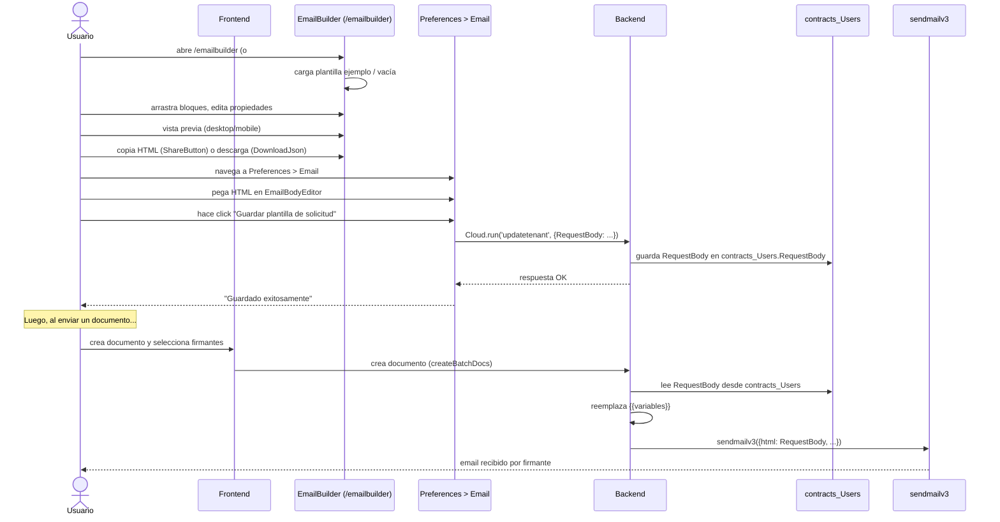

# Email Builder — Editor visual de plantillas de email

*Este documento cubre el editor visual drag & drop para personalizar plantillas de email de solicitud y completitud, accesible en `/emailbuilder`. Se verificó contra `apps/OpenSign/src/pages/EmailBuilder.tsx`, `apps/OpenSign/src/components/emailbuilder/`, `apps/OpenSign/src/components/emaileditor/`, `apps/OpenSign/src/components/preferences/MailTemplateEditor.jsx`, `apps/OpenSignServer/cloud/parsefunction/createBatchDocs.js`, `apps/OpenSignServer/cloud/parsefunction/pdf/PDF.js`, y las Cloud Functions relacionadas.*

## Arquitectura general

El EmailBuilder es un editor visual independiente — **no tiene integración backend directa para guardar plantillas**. El flujo es:

1. Usuario abre `/emailbuilder` (ruta en `apps/OpenSign/src/App.jsx`)
2. Edita visualmente la plantilla con drag & drop
3. Exporta el resultado como HTML (copiar al portapapeles o descargar archivo)
4. Pega el HTML en `Preferences > Email` (`apps/OpenSign/src/components/preferences/tabs/Email.jsx`)
5. Guarda la plantilla vía Cloud Function `updatetenant` (persiste en `contracts_Users`/`contracts_Tenant`)

Alternativamente, puede exportar como JSON (serialización `#code/<base64>` para compartir links) o usar una plantilla de ejemplo (`#sample/requestemail`, `#sample/completionemail`).

## Interfaz de usuario

Raíz: `apps/OpenSign/src/components/emailbuilder/App/index.tsx`. Estructura en tres paneles:

```
┌─────────────────────────────────────────────────────────────────────────┐
│ Toolbar (MainTabsGroup, DownloadJson, ShareButton, pantalla, toggles)   │
├──────────────────────────────┬──────────────────────────┬───────────────┤
│   SamplesDrawer              │   TemplatePanel          │  Inspector    │
│   (bloques disponibles)      │   (editor visual)        │  Drawer       │
│                              │                          │ (propiedades) │
│   • Heading                  │   [drag & drop aquí]     │               │
│   • Text                     │   [vista previa]         │  Tabs:        │
│   • Button                   │   [HTML/JSON code]       │  - Block      │
│   • Image                    │                          │    Config     │
│   • Divider                  │                          │  - Styles     │
│   • Columns                  │                          │               │
│   • Spacer                   │                          │               │
│   • HTML (custom)            │                          │               │
└──────────────────────────────┴──────────────────────────┴───────────────┘
```

### Componentes principales

- **SamplesDrawer** (`App/SamplesDrawer/`): panel izquierdo, lista de bloques (`heading`, `text`, `button`, `image`, `divider`, `columns`, `spacer`, `html`); drag & drop hacia TemplatePanel. Ancho: `SAMPLES_DRAWER_WIDTH = 280px`.
- **TemplatePanel** (`App/TemplatePanel/index.tsx`): área central; cuatro tabs:
  - `"editor"` — vista visual con drag & drop, canvas editable (componente `EditorBlock`)
  - `"preview"` — renderizado del email en un iframe (HTML sin interactividad)
  - `"html"` — vista de código HTML renderizado con syntax highlighting
  - `"json"` — vista de código JSON del documento (estructura de bloques)
- **InspectorDrawer** (`App/InspectorDrawer/`): panel derecho, dos tabs:
  - `"block-configuration"` — propiedades del bloque seleccionado (TextInput, ColorInput, SliderInput, etc., en `input-panels/helpers/inputs/`)
  - `"styles"` — estilos globales del email (ancho, fondo, tipografía, espaciado)
- **Botones/acciones**:
  - `ShareButton` — copia el HTML renderizado al portapapeles (notificación "Your current template is copied")
  - `DownloadJson` — descarga el HTML como archivo `emailTemplate.txt`
  - Toggle de pantalla (Desktop/Mobile) — cambia el viewport de edición

### Gestión de estado

Estado en Zustand (`EditorContext.tsx`):
- `document` — la configuración del email (bloques, propiedades)
- `selectedBlockId` — id del bloque seleccionado actualmente
- `selectedMainTab` — pestaña activa (editor/preview/html/json)
- `selectedScreenSize` — viewport (desktop/mobile)
- `selectedSidebarTab` — tab del inspector (block-configuration/styles)
- `inspectorDrawerOpen`, `samplesDrawerOpen` — visibilidad de paneles

## Carga de plantillas

Basada en `window.location.hash` (procesado en `getConfiguration/index.tsx`):

| Patrón | Ejemplo | Comportamiento |
|--------|---------|---|
| `#sample/requestemail` | `/emailbuilder#sample/requestemail` | Carga plantilla de ejemplo "Solicitar firma" (`getRequestEmail()`) |
| `#sample/completionemail` | `/emailbuilder#sample/completionemail` | Carga plantilla de ejemplo "Documento completado" (`getCompletionEmail()`) |
| `#code/...` | `/emailbuilder#code/eyJ...` | Decodifica base64 → JSON (deserialization de plantillas guardadas via EmailBodyEditor) |
| (ninguno) | `/emailbuilder` o `/emailbuilder#` | Carga plantilla vacía (`EMPTY_EMAIL_MESSAGE`) |

El frontend de `EmailBodyEditor` (`apps/OpenSign/src/components/EmailBodyEditor.jsx`) genera enlaces con `#sample/...` para permitir editar una plantilla de ejemplo:
```jsx
href={`/emailbuilder${template}`}  // template = "#sample/requestemail" | "#sample/completionemail" | "#"
```

## Exportación y persistencia

### Exportación a HTML

- **ShareButton**: genera HTML renderizado via `renderEmailHtml(document, "root")` → copia al portapapeles.
- **DownloadJson**: mismo HTML renderizado → descarga como `emailTemplate.txt`.
- Ambos usan `apps/OpenSign/src/components/emailbuilder/App/TemplatePanel/helper/renderEmailHtml.ts`, que transforma la estructura de bloques Zustand en HTML válido para email (compatible con clientes de email, inline CSS vía `juice`).

**NO hay guardar directo desde el EmailBuilder.** El usuario debe:
1. Copiar/descargar el HTML
2. Navegar a `Preferences > Email` (`apps/OpenSign/src/components/preferences/tabs/Email.jsx`)
3. Pegar en EmailBodyEditor (que ofrece dos modos: "basic" con Quill, "advanced" con textarea HTML)
4. Guardar via Cloud Function `updatetenant`

### Exportación como JSON

- Tab `"json"` en TemplatePanel muestra `JSON.stringify(document, null, "  ")`
- Seleccionable/copiable (HighlightedCodePanel con onclick handler)
- Puede serializarse manualmente a hash `#code/<base64(JSON)>` para compartir links (aunque no hay botón de "copy link" en la UI actual)

## Persistencia en base de datos

Las plantillas se guardan **en las preferencias del usuario/tenant**, no en el EmailBuilder:

### Cloud Function: `updatetenant` (backend)

Ubicación: `apps/OpenSignServer/cloud/parsefunction/updateTenant.js` (registrada como `updatetenant`)

Llamada desde: `MailTemplateEditor.jsx` en `handleSaveRequestEmail` / `handleSaveCompletionEmail`

Parámetros:
```js
Parse.Cloud.run('updatetenant', {
  tenantId: tenantId,
  details: {
    RequestBody: '<html>...</html>',    // HTML para email de solicitud
    RequestSubject: 'Firma requerida',
    CompletionBody: '<html>...</html>', // HTML para email de completitud
    CompletionSubject: 'Firmado',
    EmailEditorType: {
      request: 'basic' | 'advanced',
      completion: 'basic' | 'advanced'
    }
  }
})
```

Persistencia: campos en `contracts_Users` / `contracts_Tenant`:
- `RequestBody` — HTML de la plantilla de solicitud
- `RequestSubject` — asunto de solicitud
- `CompletionBody` — HTML de la plantilla de completitud
- `CompletionSubject` — asunto de completitud
- `EmailEditorType` — estado de qué editor se usó (básico/avanzado)

**Nota de seguridad** (ya documentada en `docs/cloud-functions-catalog.md`): la Cloud Function confía en el `tenantId` del cliente sin validación server-side adicional; valida que el usuario esté autenticado pero no verifica si tiene permisos en ese tenant específico.

## Uso de las plantillas en el envío de emails

Las plantillas persistidas se recuperan y usan en el backend:

### Email de solicitud

Ubicación: `apps/OpenSignServer/cloud/parsefunction/createBatchDocs.js` (envía emails cuando un documento se prepara para firma)

Lógica:
```js
let mailBody = senderObj?.TenantId?.RequestBody || '';  // fallback a vacío
// ...reemplaza variables como {{signing_url}}, {{receiver_name}}, etc.
// ...envía via sendmailv3 con el HTML procesado
```

### Email de completitud

Ubicación: `apps/OpenSignServer/cloud/parsefunction/pdf/PDF.js` (función `sendMailsaveCertifcate`, se ejecuta tras firma final)

Lógica:
```js
body = tenant?.CompletionBody ? tenant?.CompletionBody : body;  // CompletionBody si existe, else default
// ...procesa, incrusta firma, genera certificado
// ...envía via sendMailWithAttachment
```

Ambas funciones usan `sendmailv3` (Cloud Function dedicada, ubicada en `apps/OpenSignServer/cloud/parsefunction/sendMailv3.js`) que:
- Soporta SMTP (via Nodemailer) o Mailgun (via SDK)
- Inyecta variables de reemplazo: `{{sender_name}}`, `{{receiver_name}}`, `{{document_title}}`, `{{signing_url}}`
- Incrusta el HTML en el cuerpo del mensaje y lo envía

**Variables de reemplazo soportadas:**
- `{{sender_name}}` — nombre del usuario que envía
- `{{receiver_name}}` — nombre del firmante
- `{{document_title}}` — título del documento
- `{{signing_url}}` — link de firma generado
- (otros según contexto del documento)

El frontend `MailTemplateEditor.jsx` no expone un editor visual para estas variables — se insertan manualmente en el HTML (o via placeholders en el EmailBuilder que luego se editan como texto).

## Flujo completo



## Dos editores de email distintos

Existe potencial confusión entre dos componentes:

| Aspecto | EmailBuilder | EmailEditor (Quill) |
|---------|---|---|
| Ubicación | `/emailbuilder` ruta dedicada | `Preferences > Email`, tab "basic" |
| Tipo | Editor visual drag & drop (bloques: heading, text, button, image, etc.) | Editor de texto enriquecido (negritas, cursivas, listas, colores, fuentes) |
| Basado en | `@usewaypoint/email-builder` (componentes visuales, Zustand state) | Quill (rich text editor, Delta format) |
| Salida | HTML renderizado | HTML desde Quill Delta |
| Persistencia | Manual (copiar/pegar a Preferences) | Directo via updatetenant |
| Uso | Diseño complejo/profesional | Ediciones rápidas de texto |

El usuario elige:
- **EmailBuilder** si quiere un layout profesional con múltiples columnas, imágenes, espaciado exacto.
- **EmailEditor (Quill)** si solo quiere editar texto rápidamente.

Ambos convergen en que el HTML final se persiste en `RequestBody`/`CompletionBody` y se envía igual por mail.

## Notas técnicas

### Renderización de HTML

`apps/OpenSign/src/components/emailbuilder/App/TemplatePanel/helper/renderEmailHtml.ts` transforma la estructura de bloques Zustand en HTML. Usa lógica custom (no delegado a `@usewaypoint/email-builder`, aunque ese paquete sí lo proporciona via `renderToStaticMarkup`):

- Procesa cada bloque recursivamente
- Genera `<div>`, `<p>`, ``, `<a>`, `<table>` (para columnas) etc.
- Incrusta estilos inline (color, tamaño, fuente, padding)
- Genera un documento HTML válido (`<html><head>...</head><body>...</body></html>`)

### Tema Material-UI

`apps/OpenSign/src/components/emailbuilder/EmailBuildertheme.ts` define un tema MUI para el editor (colores, tipografía, breakpoints), no relacionado con el tema del email final.

### Requisitos de navegador

El EmailBuilder usa MUI, React hooks, Zustand — requiere navegador moderno con soporte ES2020+.

## Ver también

- [../README.md](../README.md)
- [./environment-variables.md](./environment-variables.md)
- [./turborepo-configuration.md](./turborepo-configuration.md)
- [./authentication-and-multitenancy.md](./authentication-and-multitenancy.md)
- [./document-preparation-and-sending.md](./document-preparation-and-sending.md)
- [./signing-ceremony.md](./signing-ceremony.md)
- [./cloud-functions-catalog.md](./cloud-functions-catalog.md)
- [./rate-limiting.md](./rate-limiting.md)
- [./testing-guide.md](./testing-guide.md)
- [./deployment-guide.md](./deployment-guide.md)
- [./opensign-drive.md](./opensign-drive.md)
- [./reports.md](./reports.md)
- [./internationalization.md](./internationalization.md)
- [./frontend-architecture.md](./frontend-architecture.md)
