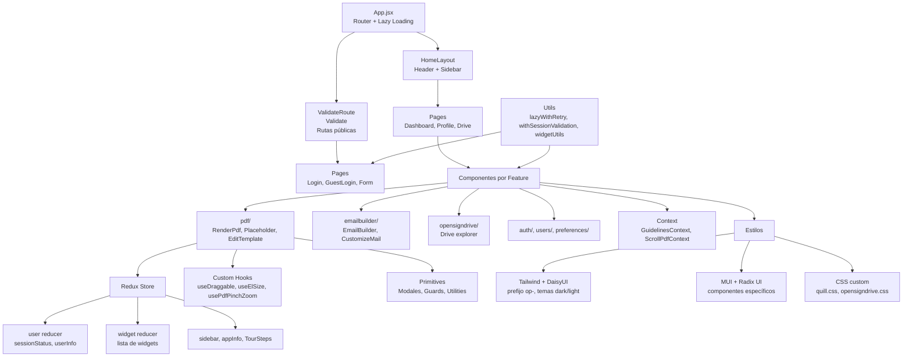

# Arquitectura del Frontend

Este documento describe la estructura, capas y patrones de organización del código frontend de FibexSign. Todo lo aquí descrito fue verificado contra `apps/OpenSign/src/` (entry point `App.jsx`, enrutamiento, estado con Redux y Context, hooks custom, componentes por feature, estilos con Tailwind/DaisyUI/MUI/Radix, y primitivos UI).

## Entry point y enrutamiento

`apps/OpenSign/src/App.jsx` es el punto de entrada: inicializa Parse SDK, carga el worker de `pdfjs-dist`, configura las variables locales de `baseUrl` y `parseAppId`, y define todas las rutas de la aplicación usando React Router v7 (`BrowserRouter` + `Routes`/`Route`).

### Lazy loading con `lazyWithRetry`

Las páginas se cargan bajo demanda mediante `React.lazy()` envuelto en `lazyWithRetry` (`apps/OpenSign/src/utils/lazyWithRetry.js`), una utilidad que captura errores de importación dinámica (típicamente causados por deploy nuevos mientras el cliente aún tiene la versión vieja en caché). Cuando detecta `/Failed to fetch dynamically imported module/`, guarda un flag en `localStorage.showUpgradeProgress`, recarga la página y muestra un progreso de actualización. Ejemplo en `App.jsx`:

```javascript
const ForgetPassword = lazyWithRetry(() => import("./pages/ForgetPassword"));
const GuestLogin = lazyWithRetry(() => import("./pages/GuestLogin"));
```

Todas las rutas lazy son envueltas en el componente `Lazy` (`apps/OpenSign/src/primitives/LazyPage.jsx`), que renderiza una pantalla de carga (`Loader`) dentro de un `Suspense` mientras la página se descarga.

### Rutas y guards

Las rutas se organizan en tres árboles principales:

1. **Routes públicas sin sesión:**
   - `<Route element={<ValidateRoute />}>` — envuelve Login, AddAdmin, Upgrade. `ValidateRoute` (`apps/OpenSign/src/primitives/ValidateRoute.jsx`) comprueba si existe `localStorage.accesstoken` y valida el token contra Parse; si es inválido, ejecuta `handlelogout()` (borra `localStorage` pero preserva configuración de tema, idioma y URLs).
   - `<Route path="/login/:base64url">` y `<Route path="/debugpdf">` — rutas sueltas, sin guardia (acceso público).

2. **Rutas protegidas para firmantes invitados:**
   - `<Route element={<Validate />}>` — envuelve el flujo de firma de invitados (`/load/recipientSignPdf`). `Validate` (`apps/OpenSign/src/primitives/Validate.jsx`) verifica sesión y renderiza `<SessionExpiredModal />` si falta `localStorage.accesstoken` o es inválido, leyendo el usuario almacenado desde `localStorage.Parse/{appId}/currentUser`.

3. **Rutas protegidas autenticadas:**
   - `<Route element={<HomeLayout />}>` — envuelve el dashboard, perfil, drive, preferencias y todas las rutas que requieren usuario logueado. `HomeLayout` (`apps/OpenSign/src/layout/HomeLayout.jsx`) renderiza header, sidebar y outlet; si la sesión caduca, el dispatch de `sessionStatus(false)` a Redux fuerza que `HomeLayout` muestre `SessionExpiredModal` en lugar del contenido.

## State management — Redux + Context

### Redux Toolkit (`apps/OpenSign/src/redux/`)

El store centralizado maneja seis dominios de estado:

- **`user`** (`userReducer.js`): `userInfo`, `isValidSession`, `isLoader`, `isTopLoader`, `tenantInfo`, `alertInfo`. Actions: `setUserInfo`, `sessionStatus`, `setTenantInfo`, `setLoader`, `setTopLoader`, `setAlertInfo`.
- **`appInfo`** (`infoReducer.js`): información global de la app (probablemente configuración de tenant, estado de upgrade).
- **`TourSteps`** (`TourStepsReducer.js`): control de onboarding/tutorial.
- **`ShowTenant`** (`ShowTenant.js`): toggle de visibilidad de tenant (probablemente para multi-tenant switching).
- **`widget`** (`widgetSlice.js`): lista de widgets colocados en el PDF, sus posiciones y propiedades (el estado "local" de un documento en edición que puede persistirse o descartarse).
- **`sidebar`** (`sidebarReducer.js`): estado del sidebar (abierto/cerrado, item seleccionado).

El store se configura en `apps/OpenSign/src/redux/store.js` usando `configureStore` de Redux Toolkit.

### Context API (`apps/OpenSign/src/context/`)

Dos contextos especializados:

- **`GuidelinesContext`** (`GuidelinesContext.jsx`): gestiona referencias DOM a las guías de alineación mostradas al arrastrar/redimensionar widgets sobre el PDF. Mantiene refs por página (`guideRefs`, `activePageRef`) y refs globales del canvas (`canvasGuideRefs`) — evita re-renders de todo el árbol en cada movimiento de píxel, usando directamente DOM manipulation a través de refs.
- **`ScrollPdfContext`** (`ScrollPdfContext.jsx`): probablemente rastrea la posición de scroll del PDF (tema oscuro/claro también mencionado en sesiones previas, manejado vía `useIsDarkTheme` hook + `data-theme` en `html`).

## Custom hooks (`apps/OpenSign/src/hook/`)

- **`useDraggable`** — detecta drag-and-drop en widgets, calcula deltas de movimiento.
- **`useElSize`** — obtiene ancho/alto de elementos DOM.
- **`useIsDarkTheme`** — consulta `[data-theme]` en el DOM para activar/desactivar tema oscuro; usado por `ThemeToggle.jsx`.
- **`useManifestUrl`** — resuelve URLs desde el manifest (probablemente para PWA o assets dinámicos).
- **`usePdfPinchZoom`** — zoom con pinch gesture en touch devices; mantiene refs de escala y punto de origen.
- **`useScript`** — carga scripts externos de forma lazy.
- **`useUserListFilters`** — estado de filtros/búsqueda en la lista de usuarios (`UserList.jsx`).
- **`useWidgetDrag`** — orquesta drag-and-drop de widgets sobre el lienzo del PDF.
- **`useWindowSize`** — reacciona a cambios de viewport (responsive).

## Componentes por dominio

`apps/OpenSign/src/components/` organiza componentes por feature, no por tipo técnico (buttons, modals, etc.):

- **`pdf/`** (40+ componentes) — editor PDF: renderizado de páginas (`RenderPdf`, `RenderAllPdfPage`), widget placement (`Placeholder`, `WidgetComponent`, `WidgetList`), edición de template (`EditTemplate`), destinatarios (`RecipientList`, `SignersInput`), tools (`PdfHeader`, `PdfTools`), etc. Documentado en profundidad en `docs/document-preparation-and-sending.md`.
- **`emailbuilder/`** — constructor visual de emails; usa `@usewaypoint/email-builder`.
- **`emaileditor/`** — editor de cuerpos de email con Quill.
- **`opensigndrive/`** — gestor de documentos (drive/almacenamiento).
- **`bulksend/`** — envío masivo de documentos.
- **`dashboard/`** — vistas del dashboard.
- **`auth/`** — componentes de autenticación (login, register, etc.).
- **`users/`** — lista y gestión de usuarios.
- **`preferences/`** — preferencias de usuario.
- **`sidebar/`** — menú lateral.
- **`shared/`** — componentes reutilizables (campos comunes, modales genéricas).
- **`__tests__/`** — tests unitarios de componentes.

Componentes raíz (`Header.jsx`, `Footer.jsx`, `Title.jsx`, `ThemeToggle.jsx`, `DragProvider.jsx`) actúan como wrappers y proveedores de contexto globales.

## Primitivos (24 componentes en `apps/OpenSign/src/primitives/`)

Componentes UI de bajo nivel y modales reutilizables:

- **Guards de ruta:** `ValidateRoute.jsx`, `Validate.jsx`, `LazyPage.jsx`.
- **Modales:** `SessionExpiredModal.jsx`, `AddContact.jsx`, `DeleteUserModal.jsx`, `PasswordResetModal.jsx`, `PdfDeclineModal.jsx`, `LinkUserModal.jsx`, `ModalUi.jsx`, `DateWidgetModal.jsx`.
- **Utilidades:** `Alert.jsx`, `CheckCircle.jsx`, `Icon.jsx` (librería de iconos), `Loader.jsx`, `LoaderWithMsg.jsx`, `Tooltip.jsx`, `Tour.jsx`, `TourContentWithBtn.jsx`.
- **Render:** `RenderReportCell.jsx`, `SignerCell.jsx`, `DownloadPdfZip.jsx`, `DotLottieReact.jsx`, `HandleError.jsx`.

## Estilos — Tailwind + DaisyUI + MUI + Radix

El proyecto combina cuatro sistemas de estilos:

1. **Tailwind CSS** (`tailwind.config.js`): framework base, con colores personalizados (`gray`, `success-scale`, `error-scale`, `warning-scale`, `blue-light`, `royal`, `night`, `peach`, `pink`, `purple`), font family `Nunito`, y redondeo consistente.

2. **DaisyUI** (`daisyui` plugin en Tailwind): componentes UI listos (buttons, modals, cards, etc.) con prefijo personalizado **`op-`** (OpenSign prefix) para evitar conflictos con clases globales. Define dos temas:
   - **`opensigndark`**: fondo `#101828` (gray-900), texto `#e6e8eb`, acentos azul/blanco.
   - **`opensigncss`**: fondo claro `#edf4fc`, azul rey `#1d4ed8` como primario, texto negro.

3. **Material UI** (`@mui/material`, `@mui/icons-material`): componentes como Tables, DatePickers, Icons. Coexiste sin conflictos de namespacing.

4. **Radix UI Themes** (`@radix-ui/themes`): system de temas agnóstico, probablemente usado en componentes específicos de preferencias o accesibilidad.

El tema se controla mediante `data-theme` en el `<html>` (ej. `<html data-theme="opensigndark">`). El hook `useIsDarkTheme` consulta ese atributo; el componente `ThemeToggle.jsx` permite cambiar entre temas y persiste la elección en `localStorage.userSettings`.

Estilos específicos viven en `apps/OpenSign/src/styles/`:
- `dark-theme-improvements.css` — refinamientos de dark mode (overrides de colors).
- `opensigndrive.css` — estilos del módulo de drive.
- `quill.css` — overrides de Quill editor.
- `signature.css` — estilos de canvas de firma.
- `WidgetNameModal.css` — estilos modales de widgets.

## Layout (`apps/OpenSign/src/layout/`)

- **`HomeLayout.jsx`** — envuelve todas las rutas autenticadas; renderiza `Header`, `Sidebar`, y `<Outlet />` para las sub-rutas. Si `sessionStatus` es `false` en Redux, muestra `SessionExpiredModal` en lugar del contenido.

## Páginas (22 archivos en `apps/OpenSign/src/pages/`)

Rutas principales de la aplicación. Ejemplos representativos:

- **`Login.jsx`** — formulario de login con contraseña; valida sesión Parse, resuelve `contracts_Users` y redirige según rol.
- **`GuestLogin.jsx`** — login OTP para firmantes invitados; maneja verificación de email y creación de contacto.
- **`Form.jsx`** (66 KB) — editor de PDF/template; arrastra widgets, asigna signatarios, configura orden de firma y OTP.
- **`TemplatePlaceholder.jsx`** (91 KB) — similiar a `Form` pero para editar plantillas guardadas.
- **`PlaceHolderSign.jsx`** (95 KB) — ubicación de campos por parte del firmante (orden 2 en la ceremonia de firma).
- **`PdfRequestFiles.jsx`** (94 KB) — firma del documento (ceremonia de firma completa).
- **`Opensigndrive.jsx`** (36 KB) — explorador de documentos/templates guardados.
- **`Report.jsx`** — vista de reporte de un documento (auditoría de firma).
- **`Dashboard.jsx`** — resumen de documentos y actividad reciente.
- **`UserProfile.jsx`** — editar datos del usuario extendido (`contracts_Users`).
- **`UserList.jsx`** (32 KB) — administración de usuarios de la organización.
- **`Managesign.jsx`** (22 KB) — gestión de perfiles/tipos de firma.
- **`Preferences.jsx`** (23 KB) — configuración de usuario (idioma, timezone, notificaciones).
- **`VerifyDocument.jsx`** — verificar integridad de un documento firmado.
- **`EmailBuilder.tsx`** — constructor visual de emails (usando `@usewaypoint`).
- **`SignyourselfPdf.jsx`** (59 KB) — caso especial: autofirma de documento.
- Páginas de soporte: `ChangePassword`, `ForgetPassword`, `DebugPdf`, `AddAdmin`, `UpdateExistUserAdmin`, `DocSuccessPage`, `PageNotFound`.

## Utils (`apps/OpenSign/src/utils/`)

Utilidades transversales:

- **`lazyWithRetry`** — detección y handling de errores de código codeado durante deploy.
- **`withSessionValidation`** (usado en 20+ componentes) — HOF que valida `localStorage.TenantId` y `Parse.User.current().getSessionToken()` antes de ejecutar un handler. Si falla, despacha `sessionStatus(false)` y aborta.
- **`fileUtils`** — validación de archivos, conversión de formatos.
- **`widgetUtils`** — cálculo de posiciones, tamaños y escalas de widgets.
- **`prefillUtils`** — datos precompletados en widgets.
- **`notificationManager`** — centraliza el manejo de toasts (usando `sonner`).
- **`sanitizeFileName`** — limpia nombres de archivo.
- **`upgradeProgress`** — UI de progreso de actualización de versión.

## Otros directorios

- **`constant/`** — configuraciones: `Utils.js` (165 KB, funciones de utilidad diversas como `defaultWidthHeight`, `replaceMailVaribles`), `appinfo.js` (URLs de backend según env), `const.js`, y getters de hash/query.
- **`json/`** — data estática: `FormJson.js`, `ReportJson.js`, `dashboardJson.js`, `menuJson.js`, `BulkSendSteps.jsx`.
- **`reports/`** — vistas de reporte: `contact/`, `document/`, `template/`.
- **`assets/`** — imágenes, iconos SVG, locales i18n.

## Diagrama — flujo de componentes y capas



## Convenciones

- **Naming de archivos:** componentes en PascalCase (`Header.jsx`), hooks en camelCase con prefijo `use` (`useIsDarkTheme.js`), utilities en camelCase (`fileUtils.js`).
- **Imágenes e íconos:** localizados en `assets/`, con un wrapper SVG/Lottie en `primitives/Icon.jsx`.
- **Traducciones:** via `react-i18next`, con loader de backend (`i18next-http-backend`).
- **Modales y dialogs:** centralizados en `primitives/`, reutilizados desde múltiples páginas.
- **Drag & Drop:** orquestado por `GuidelinesContext` (refs de alignement), `useDraggable` y `useWidgetDrag` (detectores), y componentes como `Placeholder` (receptores).

## Puntos de extensión

1. **Nueva página:** crear archivo en `pages/`, envolver en `lazyWithRetry`, agregar ruta en `App.jsx`.
2. **Nuevo widget de PDF:** agregar tipo a la lista `draggableItems` en `WidgetComponent.jsx`, default de tamaño en `constant/Utils.js`, render en `getWidgetType.jsx`.
3. **Nuevo estado global:** agregar reducer a `redux/reducers/` y agregarlo al store en `redux/store.js`.
4. **Nuevo contexto de UI:** crear proveedor en `context/`, envolver las rutas relevantes en `HomeLayout.jsx`.
5. **Nuevos estilos de tema:** extender `tailwind.config.js` (colores/tipografía) o agregar tema DaisyUI en la sección `daisyui.themes`.

## Ver también

- [../README.md](../README.md)
- [./environment-variables.md](./environment-variables.md)
- [./turborepo-configuration.md](./turborepo-configuration.md)
- [./authentication-and-multitenancy.md](./authentication-and-multitenancy.md)
- [./document-preparation-and-sending.md](./document-preparation-and-sending.md)
- [./signing-ceremony.md](./signing-ceremony.md)
- [./cloud-functions-catalog.md](./cloud-functions-catalog.md)
- [./rate-limiting.md](./rate-limiting.md)
- [./testing-guide.md](./testing-guide.md)
- [./deployment-guide.md](./deployment-guide.md)
- [./email-builder.md](./email-builder.md)
- [./opensign-drive.md](./opensign-drive.md)
- [./reports.md](./reports.md)
- [./internationalization.md](./internationalization.md)
