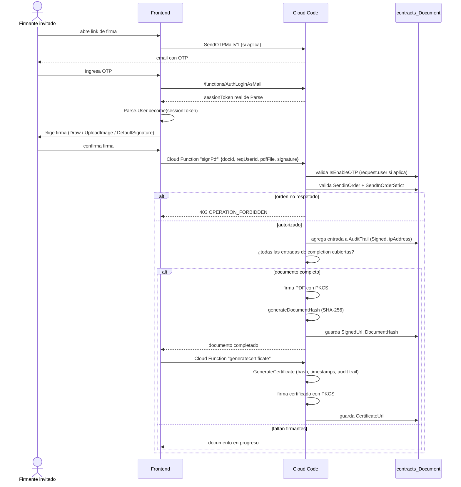

# Ceremonia de firma

Este documento cubre el flujo del lado del firmante: acceso como firmante invitado (sin cuenta previa), verificación de identidad por OTP, generación de la firma (trazo, texto/imagen), embebido de la firma en el PDF final, generación del certificado de finalización/audit trail y el rechazo (decline) de un documento. Verificado contra `apps/OpenSign/src/pages/GuestLogin.jsx`, `apps/OpenSign/src/pages/SignyourselfPdf.jsx`, `apps/OpenSign/src/components/pdf/tab/`, y las Cloud Functions bajo `apps/OpenSignServer/cloud/parsefunction/`.

## Acceso del firmante invitado

Un firmante recibe un link de firma (generado en `createBatchDocs.js`/`createDocumentFromApp.js` con forma `login/<base64(docId/email)>` o `recipientSignPdf/:docId/:contactId`) y llega a `apps/OpenSign/src/pages/GuestLogin.jsx`, que **no requiere cuenta previa en la plataforma**:

1. Si el email ya corresponde a un contacto conocido del documento, el firmante sólo necesita confirmar su email y pedir un OTP (`Parse.Cloud.run('SendOTPMailV1', { email, docId })`).
2. Si el email es nuevo, `GuestLogin.jsx` pide datos básicos (`handleUserData`) y llama `linkcontacttodoc` (`apps/OpenSignServer/cloud/parsefunction/linkContactToDoc.js`), que crea el contacto en `contracts_Contactbook` con `UserRole: 'contracts_Guest'` (un valor de texto, no un `Parse.Role`) y lo vincula al documento (placeholder, `Signers`, ACL).
3. Verificado el OTP (ver `docs/authentication-and-multitenancy.md` para el detalle del intercambio con `AuthLoginAsMail`), el cliente ejecuta `Parse.User.become(sessionToken)`: **el firmante invitado termina con una sesión Parse real**, no con un token temporal aparte. A partir de aquí, todas las llamadas del firmante llevan `X-Parse-Session-Token` como cualquier usuario logueado.
4. El cliente navega a `/load/recipientSignPdf/:docId/:contactId` (o `/recipientSignPdf/:docId/:contactId`), rutas envueltas por el componente `Validate` (`apps/OpenSign/src/primitives/Validate.jsx`), que re-verifica el `sessionToken` guardado contra `Parse.Query(Parse.User).get(...)` antes de mostrar el contenido; si falla, renderiza `SessionExpiredModal`.

## Verificación de identidad: el OTP es por documento, no global

`IsEnableOTP` es un flag de `contracts_Document`/`contracts_Template`, configurado por el remitente al preparar el documento (ver `docs/document-preparation-and-sending.md`). Su efecto se ve en dos puntos del backend:

- **Firma** (`apps/OpenSignServer/cloud/parsefunction/pdf/PDF.js`): si `IsEnableOTP` es `true`, exige `request.user` (sesión Parse válida) antes de continuar; si es `false`, el endpoint confía en el `reqUserId` recibido como parámetro para identificar al firmante en `contracts_Contactbook`, sin exigir sesión.
- **Rechazo de documento** (`apps/OpenSignServer/cloud/parsefunction/declinedocument.js`): misma lógica — con `IsEnableOTP` en `false` acepta `request.params.userId` como identidad del firmante; con `IsEnableOTP` en `true` exige `request.user`.

En ambos casos, aunque no se exija sesión Parse, sí se valida que el `userId`/`reqUserId` provisto corresponda efectivamente a un firmante o al creador del documento (`declinedocument.js` verifica `isCreator`/`isSigner` contra el array `Signers` antes de aceptar la acción). El certificado de finalización marca "Security level: Email, OTP Auth" únicamente cuando `IsEnableOTP` fue `true` para ese documento (ver más abajo).

## Generación de la firma (trazo, imagen, tipo por defecto)

El panel de firma (usado tanto en la auto-firma — `SignyourselfPdf.jsx` — como en la firma de un destinatario — `PdfRequestFiles.jsx`/`PlaceHolderSign.jsx`) ofrece varias pestañas, cada una en `apps/OpenSign/src/components/pdf/tab/`:

- **`Draw.jsx`** — trazo a mano alzada con `react-signature-canvas`. Al soltar el trazo (`onEnd`), convierte el canvas a `dataURL` (`toDataURL()`) y lo pasa a `handleSignatureChange`. También soporta "prefill": si el firmante ya tiene un trazo guardado (`prefillImg` en el store Redux `widget`), lo carga con `canvasRef.current.fromDataURL(base64)`.
- **`UploadImage.jsx`** — permite subir una imagen (`image/png`, `image/jpeg`) como firma o sello (`isStampOrImage`), con un `<input type="file" hidden>` disparado por click en el recuadro de la firma.
- **`DefaultSignature.jsx`** (dos variantes: `components/pdf/DefaultSignature.jsx` para el panel de selección/confirmación, `components/pdf/tab/DefaultSignature.jsx` para mostrar la imagen ya elegida) — permite reutilizar la firma/inicial ya configurada por el usuario en su perfil (`defaultSignImg`/`myInitial` del store Redux), con una alerta de confirmación antes de aplicarla automáticamente a todos los widgets de firma/inicial del documento.

La configuración de firma "de base" del usuario (la que usa `ManageSign.jsx`, ruta `/managesign`) se persiste vía las Cloud Functions `savesignature`/`managesign` (`apps/OpenSignServer/cloud/parsefunction/saveSignature.js`, `manageSign.js`) sobre la clase `contracts_Signature`, con un puntero `UserId` a `_User` y campos `ImageURL`, `Initials`, `Stamp`, `SignatureName`. Ambas funciones exigen que `userId === request.user?.id` (un usuario no puede escribir la firma de otro). La lectura usa `getdefaultsignature` (`getSignature.js`), con la misma validación de propiedad. `apps/OpenSignServer/cloud/parsefunction/SignatureAfterFind.js` resuelve URLs firmadas para `ImageURL`/`Initials`/`Stamp` al leer.

Qué tipos de firma están habilitados globalmente para la cuenta (dibujo, imagen, default) se controla con `updatesignaturetype` (`apps/OpenSignServer/cloud/parsefunction/updatesignaturetype.js`), que persiste un array `SignatureType` en `contracts_Users` y **exige que quede al menos un tipo habilitado distinto de "default"** (rechaza con `INVALID_QUERY` si el único tipo activo es `default`).

## Embebido de la firma y finalización del documento

La Cloud Function central de la ceremonia es `signPdf` (`apps/OpenSignServer/cloud/parsefunction/pdf/PDF.js`, registrada como `signPdf` en `main.js`). Por cada acción de firma:

1. Aplica los gates de identidad (OTP) y de orden estricto (`SendinOrder`/`SendInOrderStrict`) descritos arriba.
2. Agrega una entrada al array `AuditTrail` del documento: `{ UserPtr, SignedUrl: '', Activity: 'Signed', ipAddress }` (la IP sale de `x-real-ip`).
3. Determina si el documento quedó `isCompleted` comparando cuántas entradas de audit trail son "relevantes para completar" (`COMPLETION_ACTIVITIES`, incluye `Signed` y `Approved`) contra la cantidad de placeholders de firma/aprobación (excluyendo `Role === 'prefill'` y viewers).
4. Si quedó completo, arma la razón de firma con la lista de firmantes y **firma criptográficamente el PDF** usando `@signpdf/signpdf` + `@signpdf/signer-p12` + `@signpdf/placeholder-pdf-lib`: un certificado PKCS#12 (`.pfx`) — el propio del tenant si configuró `TenantId.PfxFile` (con su `password`), o el `PFX_BASE64`/`PASS_PHRASE` global de variables de entorno como fallback — se usa para producir una firma digital embebida real en el PDF (no una imagen superpuesta).
5. Calcula `generateDocumentHash(signedDocs)` — un hash SHA-256 del buffer final firmado — y lo persiste en el campo `DocumentHash` del documento, únicamente cuando `isCompleted` es verdadero.

## Certificado de finalización / audit trail

`generatecertificate` (`apps/OpenSignServer/cloud/parsefunction/generateCertificatebydocId.js`) sólo actúa si el documento está `IsCompleted` y todavía no tiene `CertificateUrl` (evita regenerar el certificado más de una vez). El contenido del certificado se arma en `apps/OpenSignServer/cloud/parsefunction/pdf/GenerateCertificate.js` con `pdf-lib`, y **sí contiene datos verificables reales**, no sólo texto decorativo:

- Id y nombre del documento.
- **Hash SHA-256 del documento** (`DocumentHash`), si existe.
- Organización, fecha de creación y fecha de completado (formateadas según timezone/formato de fecha del `ExtUserPtr` dueño).
- Cantidad de firmantes y datos del "document originator" (nombre, email, IP de origen del documento).
- Un bloque por cada entrada relevante del `AuditTrail`, ordenado cronológicamente por `SignedOn`, con: nombre, email, "Security level: Email, OTP Auth" (sólo si `IsEnableOTP` era `true` para ese documento), fecha de visualización (`ViewedOn`), fecha de firma (`SignedOn`), IP y la imagen de la firma embebida (o un placeholder "n/a" si no hay firma gráfica, por ejemplo en aprobaciones).

El PDF del certificado, una vez generado, **también se firma digitalmente** con el mismo mecanismo PKCS#12 (`pdflibAddPlaceholder` + `SignPdf().sign(...)`) antes de subirse y guardar su URL en `CertificateUrl`.

Adicionalmente existe `apps/OpenSign/src/pages/VerifyDocument.jsx`, una utilidad de **verificación posterior** que permite subir cualquier PDF firmado y valida, en el propio navegador, la firma digital PKCS#7 embebida (lee el diccionario de firma, el `ByteRange`, recalcula el hash del contenido y lo compara contra el message digest almacenado en la firma). Es una verificación genérica de firma digital de PDF (independiente del campo `DocumentHash`/certificado propio de FibexSign) — se confirmó su existencia y su lógica de comparación de hash por lectura de código, pero un análisis exhaustivo de la implementación ASN.1/PKCS#7 queda fuera del alcance de este documento.

## Rechazo del documento (decline)

`declinedoc` (`apps/OpenSignServer/cloud/parsefunction/declinedocument.js`) permite a un firmante o al creador rechazar un documento no completado (`IsCompleted` ≠ `true`, `IsArchive` ≠ `true`):

- Autoriza sólo si el llamante es el creador (`CreatedBy`) o figura en `Signers`.
- Setea `IsDeclined: true`, `DeclineReason`, `DeclineBy` (puntero al usuario que rechazó).
- Si quien rechaza no es el creador, notifica por email al creador (`declineMailer.send`, `sendDeclineMail`) con el motivo y un link de vuelta al documento.
- Es idempotente: si el documento ya estaba `IsDeclined`, devuelve `'document already declined'` sin volver a notificar.

## Diagrama — ceremonia de firma de un firmante invitado

## Ver también

- [../README.md](../README.md)
- [./environment-variables.md](./environment-variables.md)
- [./turborepo-configuration.md](./turborepo-configuration.md)
- [./authentication-and-multitenancy.md](./authentication-and-multitenancy.md)
- [./document-preparation-and-sending.md](./document-preparation-and-sending.md)
- [./cloud-functions-catalog.md](./cloud-functions-catalog.md)
- [./rate-limiting.md](./rate-limiting.md)
- [./testing-guide.md](./testing-guide.md)
- [./deployment-guide.md](./deployment-guide.md)
- [./email-builder.md](./email-builder.md)
- [./opensign-drive.md](./opensign-drive.md)
- [./reports.md](./reports.md)
- [./internationalization.md](./internationalization.md)
- [./frontend-architecture.md](./frontend-architecture.md)
